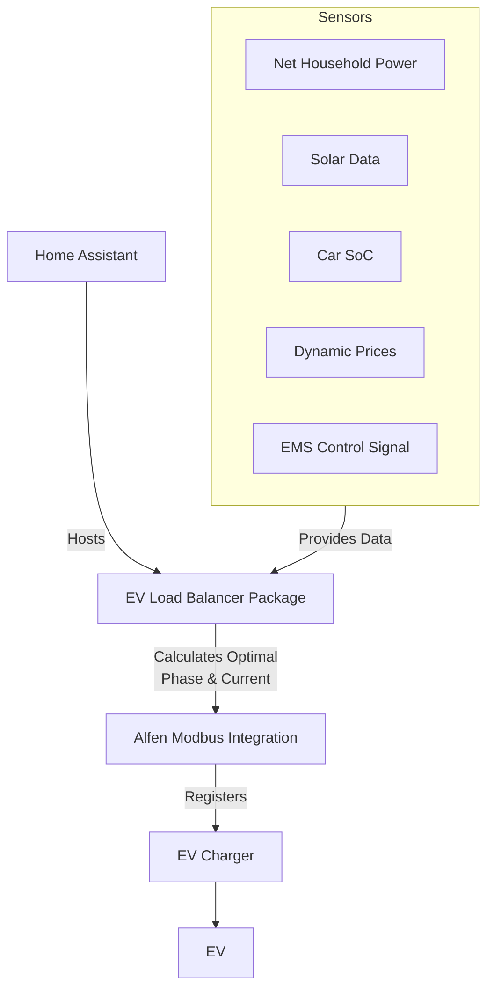
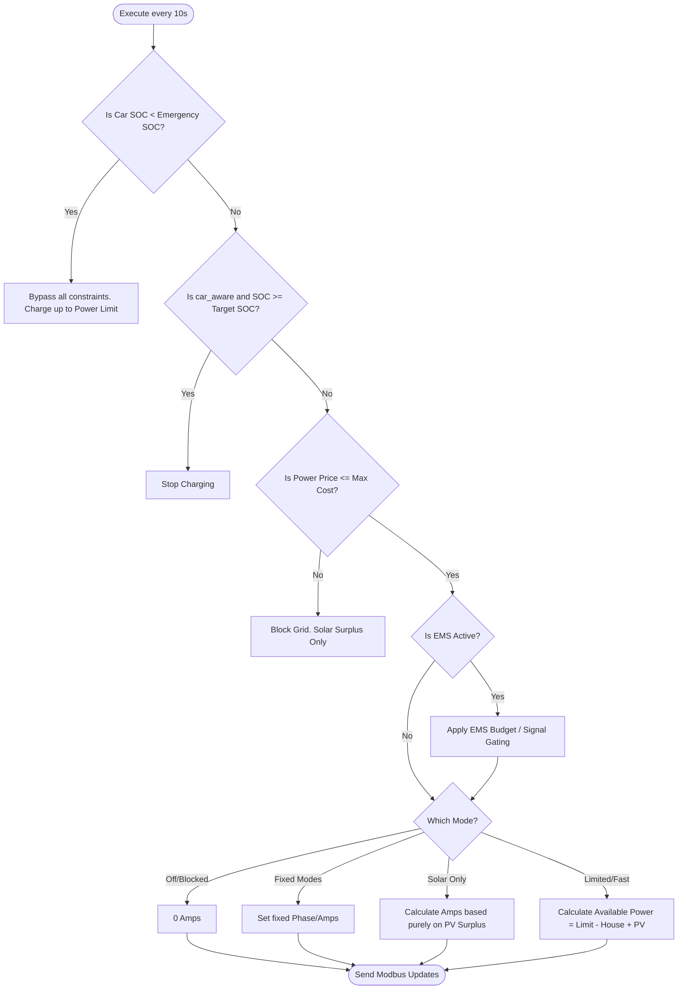

# Home Assistant Car Charging Load Balancer Automation
[](https://github.com/straybiker/HA-load-balancer/releases)
[](https://github.com/custom-components/hacs)
[](https://www.home-assistant.io/)

A car charging load balancer for Home Assistant tailored to Belgian energy regulation (Capaciteitstarief).

## Table of Contents
- [Introduction](#introduction)
- [Features](#features)
- [Prerequisites](#prerequisites)
- [Installation](#installation)
- [Details](#details)
- [Charge Modes](#charge-modes--logic)
- [Configuration and Helpers](#configuration-and-helpers)
- [Advanced Features](#advanced-features)
- [Future Developments](#future-developments)
- [Disclaimer](#disclaimer)
- [Troubleshooting](#troubleshooting)
- [Contributing](#contributing)
- [License](#license)

## Introduction
This Home Assistant automation provides intelligent load balancing for EV charging, designed to minimize energy costs and avoid exceeding your maximum power limit (capaciteitspiek) under Belgian energy regulations. By dynamically adjusting the charging phases and current based on your household's power consumption, this system helps you charge your EV efficiently without exceeding a set peak power (capaciteitstarief).

This project is ideal for users with an EV charger that can switch phases and adjust current, such as the Alfen Eve Pro wallbox. When **car-aware** mode is enabled, the load balancer can also read the car's State of Charge (SOC) to respect per-session charge limits and hardware minimums reported by the car itself.

This is not a fully-fledged Home Assistant integration (yet), but a [package](https://www.home-assistant.io/docs/configuration/packages/) that can easily be integrated into your existing Home Assistant setup.

> [!IMPORTANT]
> The separate YAML files are deprecated and archived in the archive folder.

### System Architecture


---

## Quick Start
Get up and running in 3 steps:

1. **Copy Files**: Place `packages/ev_loadbalancer.yaml` and `packages/ev_loadbalancer_user_config.yaml` into your Home Assistant `packages/` directory. (Ensure packages are enabled in your `configuration.yaml`).
2. **Update Setup**: Open `ev_loadbalancer_user_config.yaml` and replace the placeholder template sensors (e.g. `sensor.netto_verbruik_huis_lp`, `sensor.alfen_eve_real_power_sum`) with the actual entity IDs from your installation.
3. **Add Dashboard Controls**: Restart Home Assistant. The package will automatically create several UI helpers (like `input_select.ev_load_balancer_charge_mode` and `input_number.ev_load_balancer_power_limit`). Add these to your Lovelace dashboard to start controlling your charger!

---

## Features
- Dynamically adjusts EV charging based on household power consumption.
- Supports 3-phase electrical installations.
- Car-aware functionality to meet minimum SOC targets by a set time.
- Configurable modes: Off, 1-Phase Minimum, 3-Phases Minimum, Fast, Limited, Solar and Comfort.
- Handles charger efficiency and measurement noise with filtering.
- Phase switching protection to prevent frequent switching between 1 and 3 phases on days with alternating sun and clouds.
- **EMS Integration:** External control of charging modes based on price/grid signals.

## Prerequisites
- **EV charger integration**: Only 1 socket is currently supported.
- **Household power consumption sensor** excluding charger power consumption.
- For the Alfen Eve Pro
  - Active Load Balancing enabled
  - Install my fork of the Home Assistant HACS Alfen Wallbox Modbus integration: [Alfen Modbus Integration](https://github.com/straybiker/alfen_modbus). The original Alfen Modbus Integration has some stability issues and appears to be no longer maintained.

> [!WARNING]
> **CRITICAL: Flash Memory Wear on Alfen Eve**
> Do not use the Home Assistant integration [Alfen Wallbox](https://github.com/leeyuentuen/alfen_wallbox).
> That integration uses register 2129_0 to control output current, which writes to the charger's EEPROM/Flash Memory.
> Flash memory has a limited number of write cycles (typically ~100,000). Updating this every minute will physically destroy the charger's memory chip within a few months.
> Use **Active Load Balancing** instead with Modbus.
> The Alfen Wallbox integration can still be used for reading data.

> [!TIP]
> If you can't measure the household power consumption separately, create helpers to calculate the household power by subtracting the charger power from the total power consumption.

## Installation
### Step 1: Package Installation
Follow the [Home Assistant package documentation](https://www.home-assistant.io/docs/configuration/packages/) for installation details. The package files are located in the `packages` folder. You need to copy both `ev_loadbalancer.yaml` and `ev_loadbalancer_user_config.yaml`.
If you copy both yaml files to the root of the `packages` folder, you can simply activate the package by adding the following code to `configuration.yaml`.

```yaml
homeassistant:
  packages: !include_dir_named packages/
```

### Step 2: Configuration
Update `packages/ev_loadbalancer_user_config.yaml` to your specific setup and check the configuration from the developer YAML section.
The main logic file `packages/ev_loadbalancer.yaml` should not be modified to allow for easy updates.
If you don't need Car Aware functionality, the settings in the car configuration section can be left at their defaults.

> [!TIP]
> Use a low-pass filter to smooth noisy household power consumption data. Example configuration:
> ```yaml
> platform: filter
> name: "Netto verbruik huis LP"
> unique_id: netto_verbruik_huis_lp
> entity_id: sensor.netto_verbruik_huis
> filters:
>   - filter: outlier
>     window_size: 4
>     radius: 500.0
>   - filter: lowpass
>     time_constant: 12
>     precision: 2
> ```
> Here, `sensor.netto_verbruik_huis` is the raw household power consumption, and `netto_verbruik_huis_lp` is the filtered value used by the load balancer.

> [!TIP]
> For PV-aware charging, use a low-pass filter to prevent excessive switching caused by cloud coverage. Example configuration:
> ```yaml
> platform: filter
> name: "PV Power LP"
> unique_id: pv_power_lp
> entity_id: sensor.sma_power_w
> filters:
>   - filter: outlier
>     window_size: 3
>     radius: 1000.0
>   - filter: lowpass
>     time_constant: 5
>     precision: 0
> ```

### Step 3: Update script
The script to set the charger parameters currently supports the Alfen Eve Pro Single charger. Update the script outputs according to your charger.
> [!NOTE]
> The charger connection states are based on the [IEC-61851 standard](https://en.wikipedia.org/wiki/IEC_61851). If your charger is not compliant with this standard, you need to update the state mapping.

### Step 4: Reload
Restart Home Assistant.

### Step 5: Set parameters
Set the helpers that are now available in the UI to the desired values.

## Details
This load balancer checks every 10 seconds the current household power consumption and sets the charger output parameters, phase and current, according to the remaining available power. The total allowed power to use (capaciteitspiek), household + EV charger, is defined in an input helper parameter.
The load balancer also takes charger efficiency into account by comparing the calculated power output with the actual power output.

> [!NOTE]
> The maximum current can still be limited by the car's own on-board charger settings, which are respected when `car_aware` is enabled.


Here, during charging, the power is kept stable around 6000W despite major changes in household power consumption. At 18h, the car was disconnected for a while. The spikes are measurement errors.

If there is not enough power to charge at 3 phases at minimum current (6A), the charger switches to 1 phase. When the remaining power is not enough to reach even 1 phase at 6A, charging stops by setting the maximum socket current to 0A. There is a risk that the car is not charged for a prolonged period if household power consumption remains high. See [Frequent Phase Switching Protection](#frequent-phase-switching-protection) for how rapid switching is mitigated.

>[!NOTE]
>There is a built in dynamic delay in the script when the charger parameters are changed. There will be no update sent to the charger until the setting is updated or a time-out in the script occurs.

When the charger is disconnected, the charger phases and current are set to a default value. This way you shouldn't end up with a charger that is set to 0A when Home Assistant is not available.

> [!WARNING]
> There is still a risk if Home Assistant becomes unavailable during charging with the charger set at 0A. In that case you need to configure the charger directly via the [Eve Connect](https://alfen.com/en-be/eve-connect) app or the ACE Service Installer. Check your charger's manufacturer manual.

## Charge Modes & Logic
The available charge modes dictate how the car charges based on solar availability, pricing, and optional EMS signals.

| Mode | Description |
|---|---|
| **Off** | Charging disabled. |
| **1-Phase Minimum** | Fixed single-phase charging at minimum current (e.g. 6A = ~1.4 kW). Not affected by grid/EMS constraints. |
| **3-Phases Minimum** | Fixed three-phase charging at minimum current (e.g. 6A = ~4.1 kW). Not affected by grid/EMS constraints. |
| **Fast** | Full speed charging at maximum rated current. EMS can block grid usage, forcing solar-only charging if active. |
| **Limited** | Dynamic power limiting based on household consumption up to `power_limit`. EMS signal is used to cap or block grid usage. |
| **Solar** | Charges only on solar surplus. Grid is never used, regardless of EMS or price. |
| **Comfort** | Hybrid mode: behaves as **Limited** while SOC is below `comfort_soc`, then switches to **Solar** once the minimum SOC is reached. |

### Logic Decision Flow
The system executes the following checks every 10 seconds:



### Advanced Behavior Matrix
How modes interact with PV Priority and EMS signals:

| Mode | PV Prio | EMS Control | EMS Signal | Resulting Behavior |
| :--- | :--- | :--- | :--- | :--- |
| **Solar** | *Any* | *Any* | *Any* | **Solar Only**: Charges strictly on solar surplus. Grid is never used. |
| **Fast** | *Any* | OFF | - | **Max Power**: Charges at maximum capacity (e.g. 11kW). |
| | | ON | ON (>0W) | **Max Power**: EMS Budget is ignored (treated as binary "Go"). |
| | | ON | OFF (0W)| **Solar Only**: Grid blocked by EMS. Charges only if solar surplus exists. |
| **Limited**| OFF | OFF | - | **Max Grid**: Charges up to `power_limit` + Solar Surplus. |
| | | ON | ON (>0W) | **Optimized Grid**: <br>• **Budget Mode**: Grid limit = `ems_signal`.<br>• **On/Off Mode**: Grid limit = `power_limit`.<br>Solar surplus is added on *top* of this limit (Turbo). |
| | | ON | OFF (0W)| **Solar Only**: Grid blocked. Charges only on solar surplus. |
| **Limited**| ON | *Any* | *Any* | **Solar Priority**:<br>• **Sun > 0**: Follows **Solar Only** behavior (ignores Grid/EMS).<br>• **No Sun**: Follows standard **Limited** behavior (see above). |
| **Comfort**| *Any* | *Any* | *Any* | **Hybrid**:<br>• **SOC < comfort_soc**: Behaves like **Limited** (Ensures charge).<br>• **SOC ≥ comfort_soc**: Behaves like **Solar** (Saves money). |

#### EMS Configuration Highlights
1. **EMS Signal**: Define `ems_signal` in `ev_loadbalancer_user_config.yaml`. A value of `0` blocks grid usage.
2. **Control Toggle**: Turn `input_boolean.ev_load_balancer_ems_control` **ON** to enable EMS gating.
3. **Mode Toggle** (Optional): `input_boolean.ev_load_balancer_ems_as_onoff` (`false` = Budget Mode, `true` = Binary on/off Mode).

## Configuration and Helpers
Configuration is done in `packages/ev_loadbalancer_user_config.yaml`. Each logical "device" is represented as a template sensor whose attributes hold the settings. This allows the core logic file to reference a clean, stable interface regardless of your specific sensor names.

> [!TIP]
> Once the monthly peak consumption passes the set power limit of the load balancer, you can increase this limit to the new monthly peak via an automation. Don't forget to reset it at the beginning of the month.

---

### Load Balancer (`sensor.ev_load_balancer`)

The state of this sensor is the active charge mode, driven by `input_select.ev_load_balancer_charge_mode`.

#### Auto-configured attributes — backed by UI helpers the package creates automatically

These attributes are wired to `input_*` helpers that the package defines. They are ready to use out of the box — just set the desired values in the Home Assistant UI. **No changes are needed in `ev_loadbalancer_user_config.yaml` for these.**

| Attribute | Helper entity | Unit | Description |
|---|---|---|---|
| `power_limit` | `input_number.ev_load_balancer_power_limit` | W | Maximum total power (household + charging) allowed. |
| `car_aware` | `input_boolean.ev_load_balancer_car_aware` | bool | Enable car-aware mode. When enabled, the car's SOC and current limits are respected. |
| `pv_prioritized` | `input_boolean.ev_load_balancer_pv_prioritized` | bool | Solar-first priority for **Limited** mode. |
| `single_phase_only` | `input_boolean.ev_load_balancer_single_phase_only` | bool | Force all modes to single-phase. |
| `ems_control` | `input_boolean.ev_load_balancer_ems_control` | bool | Master switch to activate EMS gating. |
| `ems_as_onoff` | `input_boolean.ev_load_balancer_ems_as_onoff` | bool | `false` = Budget mode; `true` = Binary on/off mode. |
| `max_cost_rate` | `input_number.ev_max_charging_cost` | €/kWh | Maximum electricity price at which grid charging is allowed. |
| `emergency_soc` | `input_number.ev_load_balancer_emergency_soc` | % | SOC floor — below this, **all** constraints (EMS, price, solar) are bypassed. Default `20%`. |
| `target_soc` | `input_number.ev_load_balancer_target_soc` | % | *(car_aware only)* Target SOC ceiling — charging stops when this SOC is reached. Emergency SOC floor still overrides. Default `80%`. |
| `comfort_soc` | `input_number.ev_load_balancer_comfort_soc` | % | Comfort mode minimum SOC. Below this, Comfort acts as Limited; above, it switches to Solar. |

> [!NOTE]
> `target_soc` and `comfort_soc` are optional helpers. `target_soc` can be removed if car-aware mode is not used. `comfort_soc` can be removed if Comfort mode is not used.

#### User-configured attributes — require mapping to your own sensors/values

These attributes must be set in `ev_loadbalancer_user_config.yaml` to match your specific installation.

| Attribute | Unit | Description |
|---|---|---|
| `power_update_threshold` | W | *[Optional]* Minimum power change before updating the charger. Prevents excessive updates. Defaults to `230 W`. |
| `phase_switch_delay` | min | *[Optional]* Cooldown after switching 3→1 phase before allowing switch back. Defaults to `5 min`. |
| `ems_signal` | W | *[Optional]* EMS power budget in Watts. Point to a sensor such as an EMHASS deferrable output. `0` blocks the grid. |
| `electricity_price` | €/kWh | *[Optional]* Current electricity price sensor. Used with `max_cost_rate` to block grid charging when expensive. Omit or set to `0` to disable. |

---

### Charger (`sensor.ev_load_balancer_charger`)

The state of this sensor is a descriptive name for your charger (e.g. `"Alfen Eve Pro Single"`).

| Attribute | Unit | Type | Description |
|---|---|---|---|
| `active_power` | W | Sensor | Actual measured power output of the charger. Used for efficiency calculation. |
| `connection_state` | — | Sensor | Connection state of the charger. Must resolve to `"Disconnected"`, `"Connected"`, or `"Error"`. |
| `current_input` | A | Sensor | Currently applied charging current, as reported by the charger. |
| `current_output` | — | Output entity | Entity ID of the number entity used to set the charger current. |
| `phases_input` | — | Sensor | Currently active phase setting, as reported by the charger. |
| `phases_output` | — | Output entity | Entity ID of the select entity used to set the charger phase. |
| `default_current` | A | Parameter | Current to reset to when the car disconnects (e.g. `7`). |
| `default_phases` | — | Parameter | Phase count to reset to when the car disconnects (e.g. `1`). |
| `max_current` | A | Parameter/Sensor | Maximum charging current supported by the charger. Can be a fixed value or a sensor. |
| `min_current` | A | Parameter | Minimum charging current for the charger (typically `6 A`). |
| `nominal_voltage` | V | Parameter | Nominal phase voltage (typically `230 V`). |
| `phase_1_state` | — | Parameter | String value representing the 1-phase state on your charger. Default: `"1 Phase"`. |
| `phase_3_state` | — | Parameter | String value representing the 3-phase state on your charger. Default: `"3 Phases"`. |

> [!IMPORTANT]
> `current_output` and `phases_output` are **entity IDs** (plain strings, not templated sensor values). The script uses `states(entity_id)` to read them and `number.set_value` / `select.select_option` to write to them.

---

### Household (`sensor.ev_load_balancer_house`)

The state of this sensor is the current household power consumption (W). Filtered/smoothed values are strongly recommended.

| Attribute | Unit | Type | Description |
|---|---|---|---|
| `pv_power` | W | Sensor | *[Optional]* Current PV generation. A negative `household_power` (i.e. solar surplus) is used directly; this attribute is informational. |

> [!NOTE]
> The household power sensor should represent **net household consumption** — positive when consuming from the grid, negative when exporting solar surplus. The charger's own power consumption must be **excluded**.

---

### Car (`sensor.ev_load_balancer_car`)

Car configuration is optional and only needed when `car_aware` is enabled. The state of this sensor is a descriptive name for your car (e.g. `"BMW iX3"`).

| Attribute | Unit | Type | Description |
|---|---|---|---|
| `max_current` | A | Parameter | Maximum charging current supported by the car's on-board charger. |
| `min_current` | A | Parameter | Minimum charging current accepted by the car. |
| `battery_capacity_wh` | Wh | Parameter | Usable battery capacity of the car. |
| `battery_percentage` | % | Sensor | Current State of Charge (SOC) of the car battery. |

> [!NOTE]
> If any of these sensors are unavailable, the system falls back to `car_aware: false` and uses charger limits only.

---

### SOC Thresholds quick reference

| Attribute | Helper | Scope | Priority | Purpose |
|---|---|---|---|---|
| `emergency_soc` | `input_number.ev_load_balancer_emergency_soc` | All modes | **Highest** | Safety floor — bypasses **all** constraints (EMS, price, solar). Charges at `power_limit`. |
| `target_soc` | `input_number.ev_load_balancer_target_soc` | All modes (car_aware only) | High | Charging ceiling — stops all charging (including solar surplus) once reached. Emergency SOC overrides this. |
| `comfort_soc` | `input_number.ev_load_balancer_comfort_soc` | Comfort mode only | Normal | Minimum SOC for Comfort mode. Below → Limited behaviour. Above → Solar behaviour. |

> [!NOTE]
> The price guard (`electricity_price` vs `max_cost_rate`) is bypassed when SOC is below `emergency_soc`. `target_soc` only takes effect when `car_aware` is enabled and the car's SOC sensors are available and valid.

---

### Dashboard UI Example
Once configured, you can add the generated helpers directly to an entities card in your Lovelace dashboard:

```yaml
type: entities
title: EV Charging Control
entities:
  - entity: input_select.ev_load_balancer_charge_mode
    name: Charge Mode
  - entity: input_number.ev_load_balancer_power_limit
    name: Grid Peak Limit (W)
  - entity: input_boolean.ev_load_balancer_car_aware
    name: Car Aware
  - entity: input_number.ev_load_balancer_target_soc
    name: Target SOC %
  - entity: input_boolean.ev_load_balancer_pv_prioritized
    name: PV Priority Mode
  - entity: input_number.ev_load_balancer_comfort_soc
    name: Comfort SOC %
  - entity: input_number.ev_load_balancer_emergency_soc
    name: Emergency/Min SOC %
  - entity: input_boolean.ev_load_balancer_ems_control
    name: EMS External Control
  - entity: input_number.ev_max_charging_cost
    name: Max Cost rate (€/kWh)
```

## Advanced Features

### PV Optimization for Modes Limited, Solar and Comfort
- `pv_prioritized` is only applicable to **Limited** mode. When enabled, the car charges purely on solar surplus if available. If solar is insufficient, grid power fills up to `power_limit`. This is useful to maximize self-consumption while guaranteeing the car is charged.
- With **Solar** charging, only remaining solar power is used. If this is not enough to charge the car, charging stops. Useful when the car only needs a small top-up or is connected for an extended period.
- In **Comfort** mode, the system behaves as **Limited** when the current SOC is below `comfort_soc`, and as **Solar** once it exceeds it. This is *not* the same as Limited with `pv_prioritized` enabled. In Comfort, charging stops once the minimum SOC is reached, while in Limited it continues until the car is fully charged.

### Efficiency Handling
The system accounts for charger efficiency in all power calculations, by comparing the theoretical output with the real output:
- Available power is adjusted using measured charger efficiency
- Phase selection considers efficiency losses
- Current calculations include efficiency compensation
- Efficiency is calculated dynamically based on actual power measurements
- Fallback to 100% efficiency when no valid measurements are available

### Car-aware Mode Behavior
When car-aware mode is enabled (`car_aware: true`), the system reads `battery_percentage` and `battery_capacity_wh` from `sensor.ev_load_balancer_car`. If either is unavailable the system falls back to `car_aware: false`.

Car-aware mode affects two things:
1. **Current limits**: the minimum of the car's and the charger's min/max current is used.
2. **Target SOC**: charging stops automatically once `current_soc >= target_soc`. The `emergency_soc` floor still overrides this — charging resumes if SOC drops below it.

### Single Phase Operation
The load balancer can be configured to operate in single-phase mode only:
- Toggle `Single Phase Only` in the configuration to force single phase operation
- When enabled:
  - All modes will operate in single phase regardless of power availability
  - **Fast** mode will still use maximum current but only on a single phase (equivalent to 3-Phases Minimum with max current)
  - **Limited** and **Solar** modes will calculate optimal current for single phase
- Use this option if:
  - Your installation only supports single-phase charging
  - You want to minimize the impact on phase balancing
  - You prefer consistent single-phase operation

### Frequent Phase Switching Protection
The load balancer prevents rapid switching between 1 and 3 phases in dynamic modes (**Limited**, **Solar**, **Comfort**):

- When switching from 3 phases to 1 phase, a timer is started (duration set by `phase_switch_delay`, default 5 minutes).
- During this period the charger will not switch back to 3 phases even if more power becomes available; current utilization on 1 phase is maximized instead.
- This protection does not apply to manual mode changes (e.g. switching to "1-Phase Minimum" or "3-Phases Minimum").

### Robust Sensor Validity Check and Fallback
If any required sensor or attribute for the selected charge mode is unavailable, unknown, none, or non-numeric, the automation will:
- Log an error to Home Assistant's system log: `[EV Load Balancer] Base sensors unavailable or invalid - fallback to default charger values.`
- Set the charger to its default current and phase, skipping all further logic.

## Future Developments
- [x] Autocalculate charger efficiency.
- [x] Make car awareness optional.
- [x] Option to prioritize PV consumption.
- [x] Phase switching protection.
- [x] Optimize for dynamic energy contracts (EMS Integration).
- [x] Provide as a generic Home Assistant package.
- [x] Option to limit to 1 phase only.
- [x] Target SOC: stop charging when car-aware and SOC reached.
- [ ] Implement a minimum charge power instead of switching off the charger.
- [ ] Convert to a full Home Assistant integration.

## Disclaimer
The use of this automation is at your own risk. The author assumes no responsibility for any consequences arising from its use, including power consumption, vehicle SOC, or damages. Test thoroughly in your environment before relying on it for critical operations.

## Troubleshooting

### Common Issues

1. **Missing or Invalid Sensor Data**
   - If any required sensor becomes unavailable, the charger falls back to default values.
   - Check Home Assistant logs for `[EV Load Balancer] Base sensors unavailable` messages.
   - Verify all required sensors are properly configured and responding.

2. **Phase Switching Issues**
   - The timer prevents rapid phase switching.
   - Check if the phase switching timer (`timer.ev_load_balancer_phase_switching_timer`) is active.
   - Verify charger's phase switching capability.

3. **Car Awareness Not Working**
   - Ensure `car_aware` is enabled (`input_boolean.ev_load_balancer_car_aware` is **ON**).
   - Verify all car-related sensors (`battery_percentage`, `battery_capacity_wh`) are available and providing valid data.
   - Check the Developer Tools > States page for `sensor.ev_load_balancer_car` and inspect its attributes.

4. **Target SOC Not Stopping Charging**
   - Ensure `car_aware` is enabled — `target_soc` has no effect without it.
   - Check that `sensor.ev_load_balancer_car` attribute `battery_percentage` is resolving to a valid integer.
   - Verify `input_number.ev_load_balancer_target_soc` is set to the desired value in the UI.
   - Charging will resume if SOC falls below `emergency_soc`, by design.

5. **EMS Not Having Any Effect**
   - Verify `input_boolean.ev_load_balancer_ems_control` is turned **ON**.
   - Confirm `ems_signal` in the user config is resolving to a numeric float value (check with Developer Tools > Template).
   - EMS only affects **Limited**, **Comfort**, and **Fast** modes; Solar mode always ignores EMS.

### Debug Logging
To enable automation trace logging for the load balancer automation, enable trace storage in the automation settings (default 90 traces are stored). You can also check the Home Assistant log for `[EV Load Balancer]` and `[Pkg]` prefixed messages.

To enable general Home Assistant debug logging, add the following to your `configuration.yaml`:
```yaml
logger:
  default: info
  logs:
    homeassistant.components.automation: debug
```

## Contributing

Contributions are welcome! Please feel free to submit a Pull Request. For major changes:

1. Fork the repository
2. Create your feature branch (`git checkout -b feature/AmazingFeature`)
3. Commit your changes (`git commit -m 'Add some AmazingFeature'`)
4. Push to the branch (`git push origin feature/AmazingFeature`)
5. Open a Pull Request

## License
This project is licensed under the MIT License - see the [LICENSE](LICENSE) file for details.
